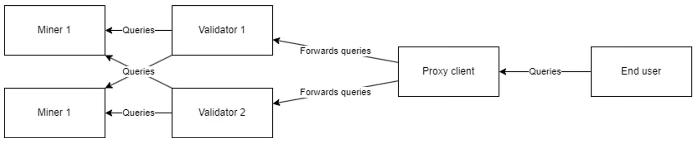

# Nichenet Proxy Client

## Description 
This API works by front-end users querying our proxy client, which is the server we use to create and authenticate API keys. From there, the proxy client forwards the queries to validators that query the miners, and then the result is returned back the same way.

Reference this [document](https://docs.nichetensor.com/) regarding how this works.

## Overview of current API


## Setup

1. Create virtual environment
```bash
python3 -m venv myenv
```

2. Activate the virtual environment
```bash
source myenv/bin/activate
```

3. Install packages
```bash
pip install -r requirements.txt
```